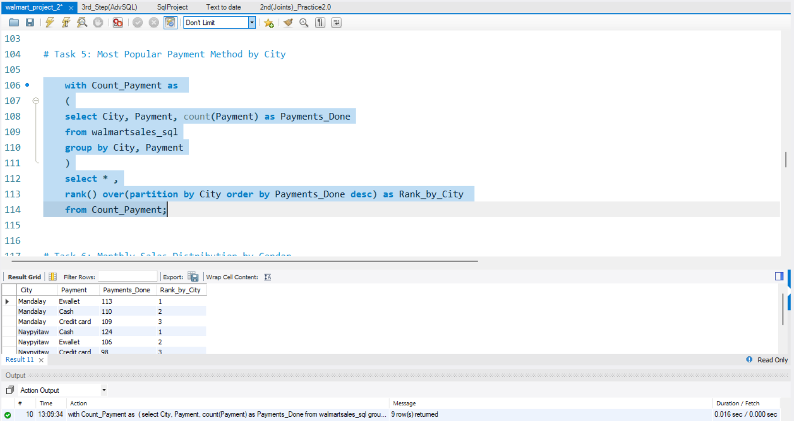
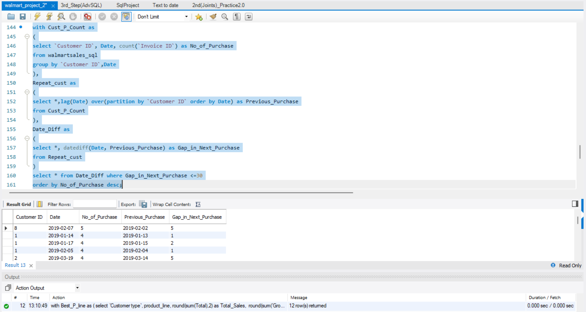

# 🛒 Walmart Sales Performance Analysis using MySQL

## 📘 Project Overview

This SQL project analyzes Walmart’s transaction data across multiple cities to uncover sales trends, customer behaviors, product performance, and operational insights. Using advanced MySQL techniques, we addressed 10 real-world business challenges with actionable outcomes.

---

## 📂 Dataset Used

- **[Walmartsales Dataset](https://docs.google.com/spreadsheets/d/1O-j6vD_uMm37pzYwvhVToTqZxw_01OTB0x2q0z00Yrc/edit?usp=sharing)**  
  Contains detailed transaction-level data including:
  - `Branch`, `City`, `CustomerType`, `Gender`, `ProductLine`, `UnitPrice`, `Quantity`
  - `Total`, `Date`, `Time`, `Payment`, `COGS`, `GrossIncome`, `Rating`

---

## ✅ Key Tasks Completed

1. 📈 **Top Branch by Sales Growth Rate**  
   → Calculated month-over-month sales growth and identified the best-performing branch.

2. 💰 **Most Profitable Product Line (Per Branch)**  
   → Determined highest-profit product lines using gross income vs. COGS.

3. 🧍‍♂️ **Customer Segmentation Based on Spending**  
   → Grouped customers as High, Medium, or Low spenders.

4. 🚨 **Sales Anomaly Detection**  
   → Flagged transactions with extreme deviations from product line averages.

5. 💳 **Most Popular Payment Method by City**  
   → Identified dominant payment modes per city.

6. 👨‍🦰👩 **Monthly Sales Distribution by Gender**  
   → Tracked gender-based sales contribution monthly.

7. 📦 **Best Product Line by Customer Type**  
   → Compared preferences of Member vs. Normal customers.

8. 🔁 **Repeat Customer Detection (within 30 days)**  
   → Detected repeat purchases using date intervals.

9. 🏅 **Top 5 Customers by Sales Volume**  
   → Ranked customers based on total revenue contribution.

10. 📅 **Sales Trend by Day of the Week**  
   → Analyzed daily revenue patterns to spot peak business days.

---

## 🧰 Tools & Techniques Used

- MySQL
- Aggregate Functions (`SUM`, `AVG`, `COUNT`)
- Date Functions (`DATEDIFF`, `MONTH`, `WEEKDAY`)
- Subqueries & CTEs
- Joins & Grouping
- CASE & IF Statements

---

## 🎞️ Deliverables

- 📄 SQL Script with All Queries
- 📊 PowerPoint Presentation with Charts & Results
- 🎥 5-Minute Video Presentation (Project Explanation + Outcomes)

---

## 📸 Screenshots

- Below are visual samples of some of the SQL analysis tasks performed in this project.

### 📈 Top Branch by Sales Growth Rate

### 💰 Most Profitable Product Line (Per Branch)

### 💳 Most Popular Payment Methods by City

### 🔁 Repeat Customer Identification

